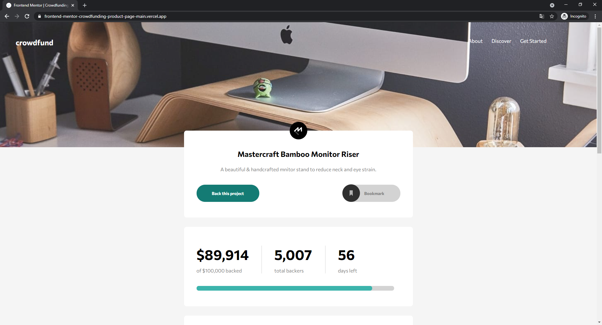

# Frontend Mentor - Crowdfunding product page solution

This is a solution to the [Crowdfunding product page challenge on Frontend Mentor](https://www.frontendmentor.io/challenges/crowdfunding-product-page-7uvcZe7ZR). Frontend Mentor challenges help you improve your coding skills by building realistic projects. 

## Table of contents

- [Overview](#overview)
  - [The challenge](#the-challenge)
  - [Screenshot](#screenshot)
  - [Links](#links)
  - [Built with](#built-with)

## Overview

### The challenge

Users should be able to:

- View the optimal layout depending on their device's screen size
- See hover states for interactive elements
- Make a selection of which pledge to make
- See an updated progress bar and total money raised based on their pledge total after confirming a pledge
- See the number of total backers increment by one after confirming a pledge
- Toggle whether or not the product is bookmarked

### Screenshot

### Links

- Solution URL: https://www.frontendmentor.io/solutions/crowdfundingproductpagemain-IMJnaG81o
- Live Site URL: https://frontend-mentor-crowdfunding-product-page-main.vercel.app/

### Built with

- Semantic HTML5 markup
- CSS custom properties
- Flexbox
- CSS Grid
- JavaScript

### Style Guide

#### Layout

The designs were created to the following widths:

- Mobile: 375px
- Desktop: 1440px

#### Colors

##### Primary

- Moderate cyan: hsl(176, 50%, 47%)
- Dark cyan: hsl(176, 72%, 28%)

##### Neutral

- Black: hsl(0, 0%, 0%)
- Dark gray: hsl(0, 0%, 48%)

#### Typography

##### Body Copy

- Font size: 16px

##### Font

- Family: [Commissioner](https://fonts.google.com/specimen/Commissioner)
- Weights: 400, 500, 700
